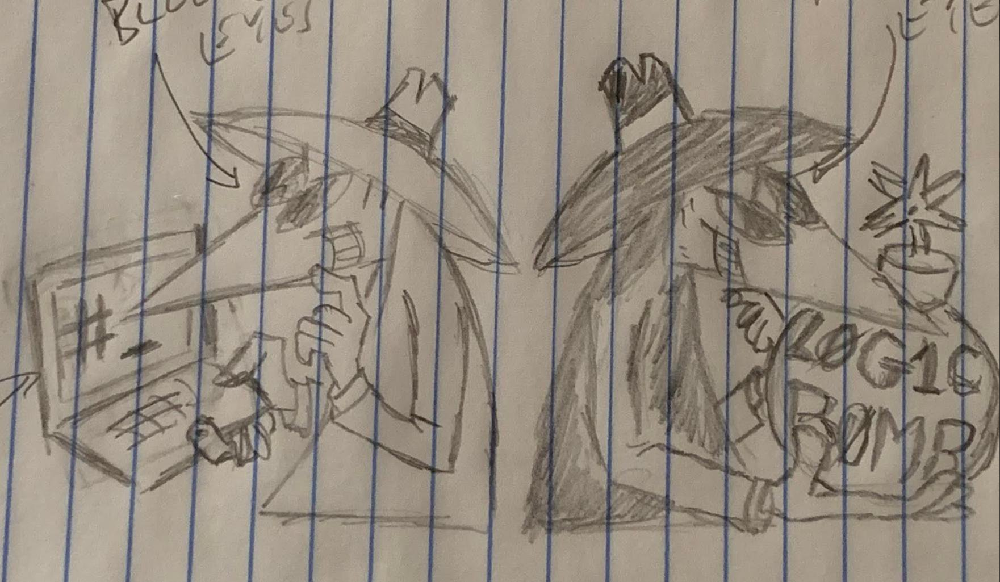
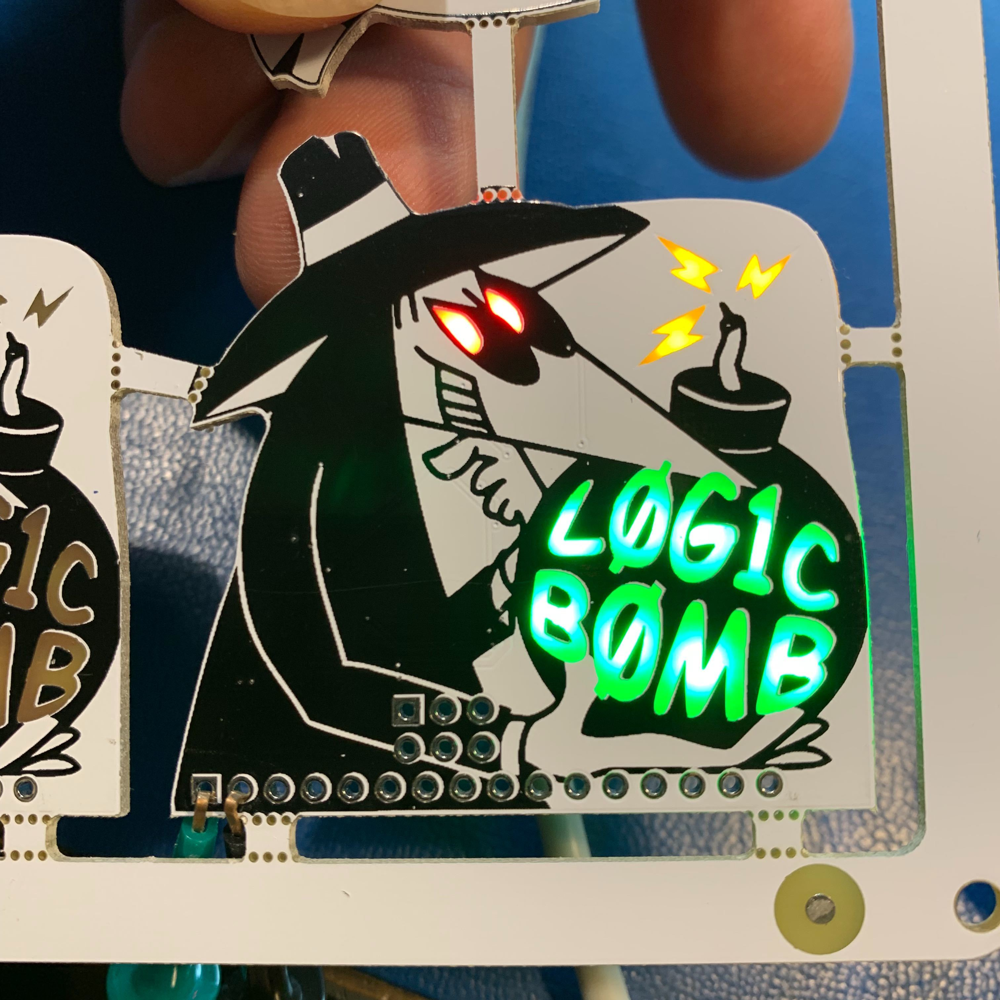
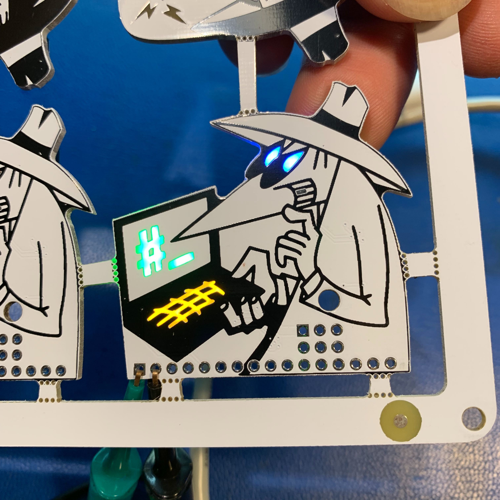

# dc27sao

	███████╗██████╗ ██╗██╗   ██╗███████╗██████╗ ██╗
	██╔════╝██╔══██╗██║██║   ██║██╔════╝██╔══██╗██║
	███████╗██████╔╝██║██║   ██║███████╗██████╔╝██║
	╚════██║██╔═══╝ ██║╚██╗ ██╔╝╚════██║██╔═══╝ ██║
	███████║██║     ██║ ╚████╔╝ ███████║██║     ██║
	╚══════╝╚═╝     ╚═╝  ╚═══╝  ╚══════╝╚═╝     ╚═╝

Blackhat spy &amp; Whitehat spy SAO from Def Con 27

The pencil sketch that started it all on June 14th:



Bling bling:





## WTF is all this crap

- `/firmware` - shitty code that runs the blinkenlites
- `/gui` - not-so-shitty gui animation code generator tool (with shittyness added in a rush at the end)
- `/hardware` - schematics and pcb stuff
- `/img` - some pix from the adventure

## Other crap

- The twitters https://twitter.com/SPIvSPI
- Hackaday page https://hackaday.io/project/166811-spivspi-sao-dc27-badge

## Guilty Parties

```
xres0nance - Hardware & firmware
steve/corelit - Over-excellent GUI animation tool
```

## Shoutz n Greetz

```
true, cprossu, aask, & WP crew - 8051 wisdom and moral support
jrwr - crazy drunk russians and a dope-ass hat
MCB - melted lead shoulder-to-shoulder, six pins at a time
woodencyborg - for diving in the deep end with us
pcbway - haulin' ass, gettin' paid
```

and thanks to all our other cheerleaders! couldn't have done it without ya.
